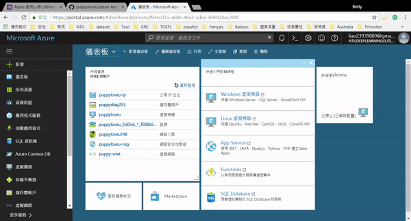
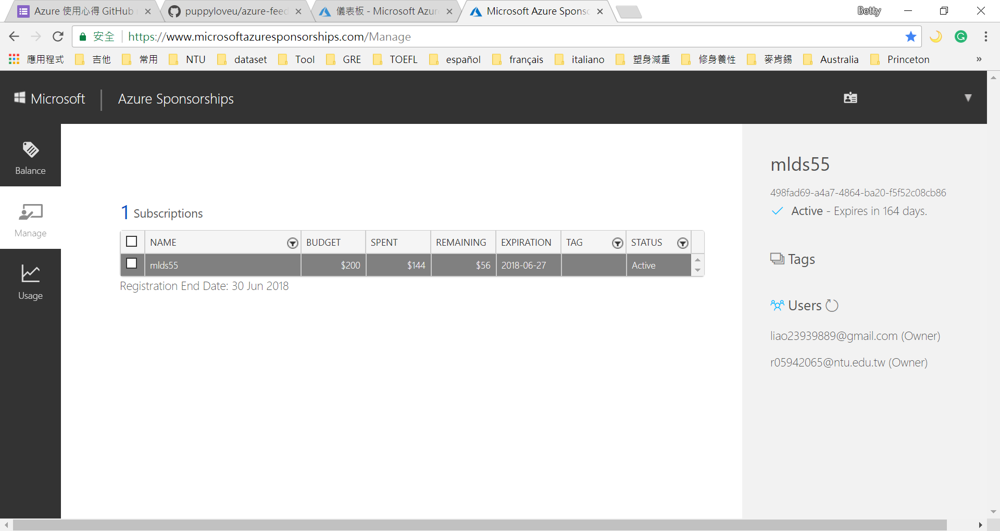

# Azure使用心得

* **感謝微軟支援我們運算資源**
* **優點一**: 虛擬機的memory大小達到11G,對於我們做作業非常有幫助,由於作業一、二和四的dataset也是好幾Ｇ,在train model時,batch size可以設較大,也能嘗試調大size的model
* **優點二**: GPU加速運算,每個作業加上期末專題都非常需要GPU加速運算,對於沒有support的學生,光靠CPU修這門課根本是不可能的任務,再次謝謝微軟提供Azure平台,實現我們的夢想
* **優點三**: 機器很給力,連續開著跑好幾天都不容易當機,讓我們可以利用睡覺時間盡情嘗試、盡情train model
* **優點四**: 任何時刻,一鍵啟動等待幾分鐘後,就能使用,還沒遇過要維修暫時不能使用的狀況
* **優點五**: 價格合理,一小時使用費1美元,因為如果要買一台機器,好的GPU搭配好的CPU和足夠的memory至少需要3000美元,而使用Azure我們這學期平均一人使用200美元,看起來省很多

* **小小缺點**: 跟大部分機器一樣,有時候會抓不到GPU跑,不過reboot後就可以了,之前沒注意傻傻用了CPU跑,驚覺速度超慢,所以在每次開機使用的時候,還是要看著terminal,確保有抓到GPU跑後,再放心去做其他事
* **感謝微軟提供Azure贊助**
* **感謝微軟提供期末pizza贊助**